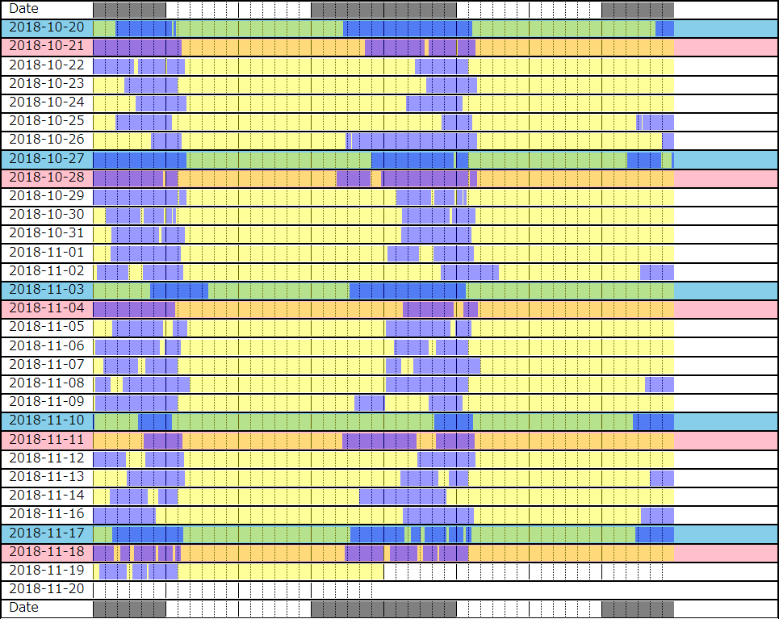

# sleepchart.html

Visualize a sleep chart from life log using HTML.

## Requrements

* Modern web brower which support HTML5.

## Usage

Open `sleepchart.html` with the web browser and drag and drop a sleep log file into `drop files` element.

## Format of the life log

Basic rules to write the life log is below:

```
YYYYmmdd
HHMM	[sw]([,、]<comment>)?
(<comment>)?
...
END
(<comment>)?
```

`s` and `w` mean `sleep` and `wake`.
Note that timestamp and these events are separated a `TAB` character.

Any comment except after `END` must be not matched timestamp.

### Example

My life log around the term since 2018-10-20 to 2018-11-18 is below:

* [lifelog_example_20181020-20181119.txt](lifelog_example_20181020-20181119.txt)

And a result of rendering it is below:



I wrote it by Android using following text editors:

* [Jota Text Editor](https://play.google.com/store/apps/details?id=jp.sblo.pandora.jota) (free)
* [QuickEdit Text Editor](https://play.google.com/store/apps/details?id=com.rhmsoft.edit) (free)
* [QuickEdit Text Editor Pro](https://play.google.com/store/apps/details?id=com.rhmsoft.edit.pro) (paid: current my environment)

In the past, I was saving it to local storage.
In the recent years, I'm saving it to Google Drive.

## License

Copyright (c) 2019 Koichi OKADA. All rights reserved.

This project is distributed under [the MIT license](http://www.opensource.org/licenses/MIT).
